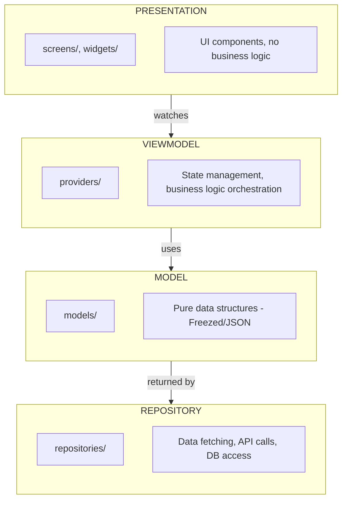

# arsync_lints

A powerful custom lint package for Flutter/Dart that enforces the **Arsync 4-Layer Architecture** with strict separation of concerns, Riverpod best practices, and clean code standards.

[](https://dart.dev)
[](https://flutter.dev)
[](LICENSE)

## Overview

`arsync_lints` treats architectural violations as **build errors**, not warnings. This ensures your codebase maintains clean architecture from day one and prevents "spaghetti code" from creeping into your project.

### The 4-Layer Architecture



## Installation

### 1. Add dependencies to your `pubspec.yaml`

```yaml
dev_dependencies:
  arsync_lints: ^1.0.0
  custom_lint: ^0.7.3
```

### 2. Enable the plugin in `analysis_options.yaml`

```yaml
analyzer:
  plugins:
    - custom_lint
```

### 3. Run the analyzer

```bash
# In your IDE, the lints will appear automatically
# Or run manually:
dart run custom_lint
```

## Rules Reference

### Category A: Architectural Layer Isolation

These rules prevent layers from "leaking" into each other.

| Rule | Target | Description |
|------|--------|-------------|
| `presentation_layer_isolation` | `screens/`, `widgets/` | Cannot import repositories, cloud_firestore, http, or dio. Use Dart records instead of parameter classes. |
| `shared_widget_purity` | `widgets/` | Cannot import providers or Riverpod packages. Each file must have only ONE public widget. |
| `model_purity` | `models/` | Must use @freezed and have fromJson factory; no provider imports |
| `repository_isolation` | `repositories/` | Cannot import screens or UI-specific Riverpod (flutter_riverpod, hooks_riverpod) |

#### Example: presentation_layer_isolation

```dart
// BAD - lib/screens/home_screen.dart
import 'package:my_app/repositories/auth_repository.dart'; // ERROR!
import 'package:dio/dio.dart'; // ERROR!

class HomeScreen extends StatelessWidget {
  @override
  Widget build(BuildContext context) {
    final repo = AuthRepository(); // Direct repo access!
    return Container();
  }
}

// GOOD - lib/screens/home_screen.dart
import 'package:my_app/providers/auth_provider.dart';

class HomeScreen extends ConsumerWidget {
  @override
  Widget build(BuildContext context, WidgetRef ref) {
    final authState = ref.watch(authProvider); // Watch provider instead
    return Container();
  }
}
```

#### Example: shared_widget_purity (Single Widget Per File)

```dart
// BAD - lib/widgets/buttons.dart
class PrimaryButton extends StatelessWidget {} // OK - first public widget
class SecondaryButton extends StatelessWidget {} // ERROR! Multiple public widgets

// GOOD - lib/widgets/primary_button.dart
class PrimaryButton extends StatelessWidget {}
class _ButtonContent extends StatelessWidget {} // OK - private helper
```

#### Example: Use Records Instead of Parameter Classes

```dart
// BAD - lib/screens/profile_screen.dart
class UpdateProfileParams {
  final String userId;
  final String name;
  const UpdateProfileParams({required this.userId, required this.name});
}

// GOOD - Use Dart records
typedef UpdateProfileParams = ({
  String userId,
  String name,
  String? phone,
});

// Usage
void updateProfile(UpdateProfileParams params) {
  print(params.userId);
}
```

---

### Category B: Riverpod & State Management

These rules enforce the "Arsync Riverpod Pattern".

| Rule | Target | Description |
|------|--------|-------------|
| `provider_autodispose_enforcement` | `providers/` | Providers must use `.autoDispose` or call `ref.keepAlive()`. |
| `provider_file_naming` | `providers/` | Files must end with `_provider.dart` and contain a matching Notifier class |
| `provider_state_class` | `providers/` | State classes must be @freezed and defined in the same file |
| `provider_declaration_syntax` | `providers/` | Must use `.new` constructor syntax (e.g., `AuthNotifier.new`) |
| `provider_class_restriction` | `providers/` | Only Notifier classes and @freezed state classes allowed |
| `provider_single_per_file` | `providers/` | Each file can only have ONE NotifierProvider matching the file name |
| `viewmodel_naming_convention` | `providers/` | Notifier classes must end with "Notifier" |
| `no_context_in_providers` | `providers/` | BuildContext cannot be used as a parameter |
| `async_viewmodel_safety` | `providers/` | Async methods in Notifiers must have try/catch |

#### Example: provider_file_naming

```dart
// File: lib/providers/auth_provider.dart

// GOOD
class AuthNotifier extends Notifier<AuthState> { ... } // Matches file name prefix

// BAD - lib/providers/auth.dart (missing _provider suffix)
// BAD - lib/providers/auth_provider.dart with class UserNotifier (prefix mismatch)
```

#### Example: provider_declaration_syntax

```dart
// BAD - Explicit generics and closure
final authProvider = NotifierProvider.autoDispose<AuthNotifier, AuthState>(
  () => AuthNotifier(),
);

// GOOD - Clean .new syntax
final authProvider = NotifierProvider.autoDispose(AuthNotifier.new);
```

#### Example: provider_autodispose_enforcement

```dart
// BAD - Memory leak potential
final authProvider = NotifierProvider<AuthNotifier, AuthState>(() {
  return AuthNotifier();
}); // ERROR: Missing autoDispose

// GOOD - Option 1: Use autoDispose
final authProvider = NotifierProvider.autoDispose(AuthNotifier.new);

// GOOD - Option 2: Use keepAlive for persistent state
final authProvider = NotifierProvider(AuthNotifier.new);

class AuthNotifier extends Notifier<AuthState> {
  @override
  AuthState build() {
    ref.keepAlive(); // Explicitly opt-in to persistence
    return AuthState();
  }
}
```

#### Example: provider_state_class

```dart
// BAD - State class not @freezed
class AuthState {
  final bool isLoggedIn;
  AuthState(this.isLoggedIn);
}

// GOOD - Immutable state with @freezed
@freezed
class AuthState with _$AuthState {
  const factory AuthState({
    @Default(false) bool isLoggedIn,
    User? user,
  }) = _AuthState;
}
```

#### Example: provider_single_per_file

```dart
// BAD - lib/providers/auth_provider.dart
final authProvider = NotifierProvider.autoDispose(AuthNotifier.new);
final userProvider = NotifierProvider.autoDispose(UserNotifier.new); // ERROR!

// GOOD - One provider per file
// lib/providers/auth_provider.dart -> authProvider
// lib/providers/user_provider.dart -> userProvider
```

#### Example: async_viewmodel_safety

```dart
// BAD - Unhandled async errors
class UserNotifier extends AsyncNotifier<User> {
  Future<void> fetchUser() async {
    await userRepository.getUser(); // ERROR: No try/catch
  }
}

// GOOD - Proper error handling
class UserNotifier extends AsyncNotifier<User> {
  Future<void> fetchUser() async {
    try {
      await userRepository.getUser();
    } catch (e) {
      ref.showExceptionSheet(e);
    }
  }
}
```

---

### Category C: Repository & Data Integrity

| Rule | Target | Description |
|------|--------|-------------|
| `repository_provider_declaration` | `repositories/` | Must define a Provider ending with `RepoProvider` |
| `repository_dependency_injection` | `repositories/` | Dependencies must be injected via constructor; `Ref` parameter banned |
| `repository_class_restriction` | `repositories/` | Only classes with "Repository" in name; files must end with `_repository.dart` |
| `repository_no_try_catch` | `repositories/` | Repositories must throw errors, not catch them |
| `repository_async_return` | `repositories/` | Public methods must return `Future<T>` or `Stream<T>` |

#### Example: repository_provider_declaration

```dart
// lib/repositories/auth_repository.dart

// GOOD - Provider at top ending with RepoProvider
final authRepoProvider = Provider<AuthRepository>((ref) {
  final dio = ref.watch(dioProvider);
  return AuthRepository(dio);
});

class AuthRepository {
  final Dio _dio;
  AuthRepository(this._dio);
}
```

#### Example: repository_dependency_injection

```dart
// BAD - Direct instantiation
class AuthRepository {
  final Dio _dio = Dio(); // ERROR: Create objects directly
}

// BAD - Ref parameter
class AuthRepository {
  final Ref ref; // ERROR: Ref not allowed
  AuthRepository(this.ref);
}

// GOOD - Constructor injection
class AuthRepository {
  final Dio _dio;
  AuthRepository(this._dio); // Injected via provider
}
```

#### Example: repository_no_try_catch

```dart
// BAD - Swallowing errors
class UserRepository {
  Future<User?> getUser(String id) async {
    try {
      return await api.fetchUser(id);
    } catch (e) {
      return null; // ERROR: Hiding the error!
    }
  }
}

// GOOD - Let errors bubble up
class UserRepository {
  Future<User> getUser(String id) async {
    return await api.fetchUser(id); // Throws on error
  }
}
```

---

### Category D: Code Quality & Complexity

| Rule | Description |
|------|-------------|
| `complexity_limits` | Max 4 parameters, max 3 nesting levels, max 60 lines per method, max 120 lines in build(), no nested ternary |
| `global_variable_restriction` | Top-level variables must be private (`_`), constants (`k` prefix), or Providers. Top-level functions must be private, `k`-prefixed (in constants.dart), or `main()` |
| `print_ban` | `print()` and `debugPrint()` are banned; use custom logging using log() extension method on Object |
| `barrel_file_restriction` | No `index.dart` barrel files in screens/, features/, widgets/, or providers/ |
| `ignore_file_ban` | `// ignore_for_file:` comments are banned |

#### Example: complexity_limits

```dart
// BAD - Nested ternary
Widget build(BuildContext context) {
  return isLoading
    ? LoadingWidget()
    : hasError
      ? ErrorWidget()  // ERROR: Nested ternary!
      : ContentWidget();
}

// GOOD - Use if/else or switch
Widget build(BuildContext context) {
  if (isLoading) return LoadingWidget();
  if (hasError) return ErrorWidget();
  return ContentWidget();
}

// BAD - Too many parameters (max 4)
void updateUser(
  String id,
  String name,
  String email,
  String phone,
  String address, // ERROR: More than 4 parameters
) {}

// GOOD - Use a parameter object
void updateUser(UpdateUserParams params) {}

// BAD - Method exceeds 60 lines
void processData() {
  // ... 61+ lines of code ... // ERROR!
}

// GOOD - Extract into smaller methods
void processData() {
  _validateInput();
  _transformData();
  _saveResult();
}
```

#### Example: global_variable_restriction

```dart
// BAD - lib/utils/helpers.dart
String globalApiUrl = 'https://api.example.com'; // ERROR!
void helperFunction() {} // ERROR: Top-level function

// GOOD - lib/utils/constants.dart
const kApiUrl = 'https://api.example.com'; // OK: k prefix in constants.dart
void kFormatDate() {} // OK: k prefix in constants.dart

// GOOD - lib/providers/config_provider.dart
final configProvider = Provider((ref) => Config()); // OK: Provider variable

// GOOD - Private functions anywhere
void _internalHelper() {} // OK: Private function
```

---

### Category E: UI Safety & Consistency

| Rule | Target | Description |
|------|--------|-------------|
| `hook_safety_enforcement` | `build()` methods | Controllers must use hooks; `GlobalKey<FormState>()` banned in HookWidgets |
| `scaffold_location` | `widgets/` | Scaffold is not allowed in widgets folder |
| `asset_safety` | All files | Image.asset() must use constants, not string literals |
| `file_class_match` | All files | Class name must match file name (snake_case to PascalCase) |

#### Example: hook_safety_enforcement

```dart
// BAD - Memory leak in build
class MyWidget extends HookConsumerWidget {
  @override
  Widget build(BuildContext context, WidgetRef ref) {
    final controller = TextEditingController(); // ERROR: Leaks memory!
    return TextField(controller: controller);
  }
}

// GOOD - Use hooks
class MyWidget extends HookConsumerWidget {
  @override
  Widget build(BuildContext context, WidgetRef ref) {
    final controller = useTextEditingController();
    return TextField(controller: controller);
  }
}

// BAD - GlobalKey<FormState> resets on keyboard open/orientation change
class MyFormWidget extends HookConsumerWidget {
  @override
  Widget build(BuildContext context, WidgetRef ref) {
    final formKey = GlobalKey<FormState>(); // ERROR: Resets unexpectedly!
    return Form(key: formKey, child: ...);
  }
}

// GOOD - Use GlobalObjectKey with context for stable identity
class MyFormWidget extends HookConsumerWidget {
  @override
  Widget build(BuildContext context, WidgetRef ref) {
    final formKey = GlobalObjectKey<FormState>(context); // Stable across rebuilds
    return Form(key: formKey, child: ...);
  }
}
```

#### Example: asset_safety

```dart
// BAD - Typo-prone string literal
Image.asset('assets/images/logo.png'); // ERROR!

// GOOD - Use constants
// lib/utils/images.dart
class Images {
  static const logo = 'assets/images/logo.png';
}

// Usage
Image.asset(Images.logo);
```

#### Example: file_class_match

```dart
// File: lib/screens/user_profile_screen.dart

// BAD
class ProfilePage {} // ERROR: Should be UserProfileScreen

// GOOD
class UserProfileScreen {} // Matches file name
```

---

## Complete Rules List

| # | Rule Name | Category | Target |
|---|-----------|----------|--------|
| 1 | `presentation_layer_isolation` | Architecture | screens/, widgets/ |
| 2 | `shared_widget_purity` | Architecture | widgets/ |
| 3 | `model_purity` | Architecture | models/ |
| 4 | `repository_isolation` | Architecture | repositories/ |
| 5 | `provider_autodispose_enforcement` | Riverpod | providers/ |
| 6 | `provider_file_naming` | Riverpod | providers/ |
| 7 | `provider_state_class` | Riverpod | providers/ |
| 8 | `provider_declaration_syntax` | Riverpod | providers/ |
| 9 | `provider_class_restriction` | Riverpod | providers/ |
| 10 | `provider_single_per_file` | Riverpod | providers/ |
| 11 | `viewmodel_naming_convention` | Riverpod | providers/ |
| 12 | `no_context_in_providers` | Riverpod | providers/ |
| 13 | `async_viewmodel_safety` | Riverpod | providers/ |
| 14 | `repository_provider_declaration` | Repository | repositories/ |
| 15 | `repository_dependency_injection` | Repository | repositories/ |
| 16 | `repository_class_restriction` | Repository | repositories/ |
| 17 | `repository_no_try_catch` | Repository | repositories/ |
| 18 | `repository_async_return` | Repository | repositories/ |
| 19 | `complexity_limits` | Code Quality | lib/ |
| 20 | `global_variable_restriction` | Code Quality | lib/ |
| 21 | `print_ban` | Code Quality | lib/ |
| 22 | `barrel_file_restriction` | Code Quality | lib/ |
| 23 | `ignore_file_ban` | Code Quality | lib/ |
| 24 | `hook_safety_enforcement` | UI Safety | build() methods |
| 25 | `scaffold_location` | UI Safety | widgets/ |
| 26 | `asset_safety` | UI Safety | All files |
| 27 | `file_class_match` | UI Safety | All files |

---

## Configuration

All rules are enabled by default with ERROR severity. To customize, add to your `analysis_options.yaml`:

```yaml
custom_lint:
  rules:
    # Disable a specific rule
    - presentation_layer_isolation: false

    # All rules are enabled by default
    - shared_widget_purity
    - model_purity
    - repository_isolation
    - provider_autodispose_enforcement
    - provider_file_naming
    - provider_state_class
    - provider_declaration_syntax
    - provider_class_restriction
    - provider_single_per_file
    - viewmodel_naming_convention
    - no_context_in_providers
    - async_viewmodel_safety
    - repository_provider_declaration
    - repository_dependency_injection
    - repository_class_restriction
    - repository_no_try_catch
    - repository_async_return
    - complexity_limits
    - global_variable_restriction
    - print_ban
    - barrel_file_restriction
    - ignore_file_ban
    - hook_safety_enforcement
    - scaffold_location
    - asset_safety
    - file_class_match
```

## Project Structure

For `arsync_lints` to work correctly, organize your project like this:

```
lib/
├── main.dart
├── screens/              # UI pages (can use Scaffold)
│   ├── home/
│   │   └── home_screen.dart
│   └── auth/
│       └── login_screen.dart
├── widgets/              # Reusable UI components (no Scaffold, no providers)
│   ├── buttons/
│   │   └── primary_button.dart
│   └── cards/
│       └── user_card.dart
├── providers/            # State management (Riverpod Notifiers)
│   ├── core/             # Infrastructure providers (dioProvider, etc.)
│   │   └── dio_provider.dart
│   ├── auth_provider.dart
│   └── user_provider.dart
├── models/               # Data classes (Freezed)
│   ├── user.dart
│   └── auth_state.dart
├── repositories/         # Data access layer
│   ├── auth_repository.dart
│   └── user_repository.dart
└── utils/
    ├── constants.dart    # k-prefixed constants and functions
    └── images.dart       # Asset path constants
```

## Suppressing Rules

While `// ignore_for_file:` is banned, you can still use line-specific ignores for rare exceptions:

```dart
// ignore: print_ban
print('Debug only - remove before commit');
```

## CI/CD Integration

Add to your CI pipeline to enforce architecture:

```yaml
# GitHub Actions example
- name: Run Lints
  run: dart run custom_lint --fatal-infos --fatal-warnings
```

## Philosophy

> "Architecture is about intent. These rules make your intent explicit and your boundaries clear."

The Arsync architecture is designed to:

1. **Prevent spaghetti code** - Clear boundaries between layers
2. **Enable testability** - Each layer can be tested in isolation
3. **Improve maintainability** - New developers understand the structure immediately
4. **Catch issues early** - Violations are build errors, not runtime surprises

## Contributing

Contributions are welcome! Please feel free to submit issues and pull requests.

## License

MIT License - see [LICENSE](LICENSE) for details.
